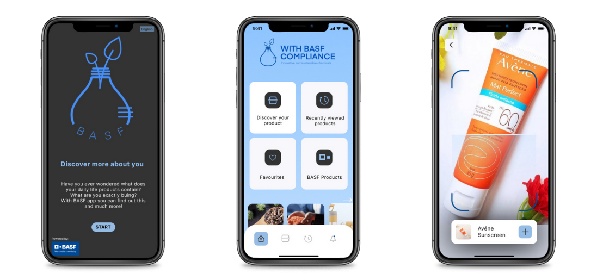
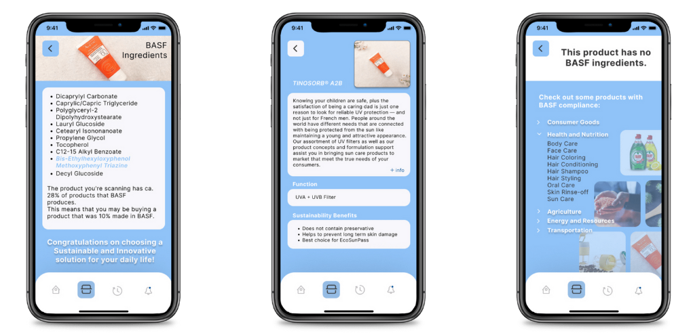

# HerHackathon-BASF-Sonequitas
This project earned our team 1st place 🥇 in the BASF competition and 2nd in the Hackathon 🏆
## Backend for bar code app
- Receives a product's barcode number (read via mobile barcode reader)
- Crosschecks the number with a list of product's barcodes using an API
  - https://api.barcodelookup.com/v3/products
- Fetches the list of ingredients of the scanned product
- Compares with BASF catalogue
- Returns list of ingredients found that BASF produces

### Current status
- The API selected had poor data, returning only a few products with a complete ingredients list
- For proof of concept, a list of products and respective ingredients was added to the code

